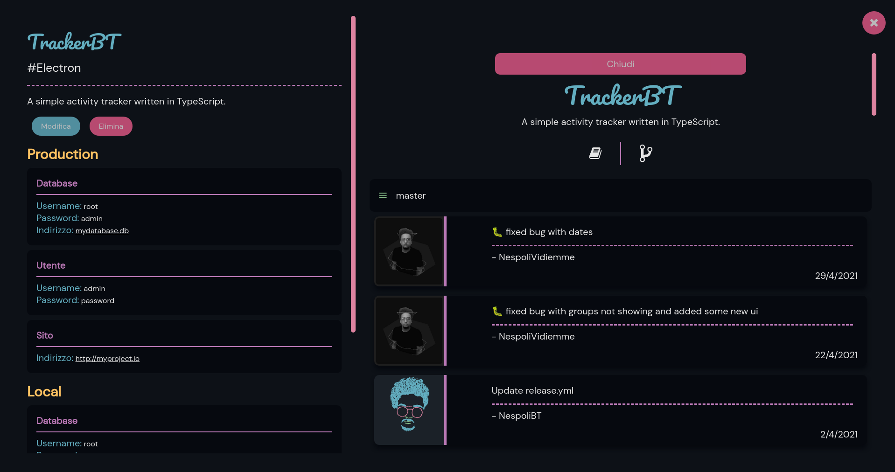

# ProjectsBT

## Description

ProjectsBT is a project management tool for the busy developer.
It is meant to help you to keep track of your projects and all their documentation.

### Features

Most of the feautures come from plugins, here are some of them:

- Database
- User
- Website

These can be used to add documentation to your project.

## Screenshot

## Installation

The best way to install ProjectsBT is to get it from the [release page](https://github.com/NespoliBT/ProjectsBT/releases)
